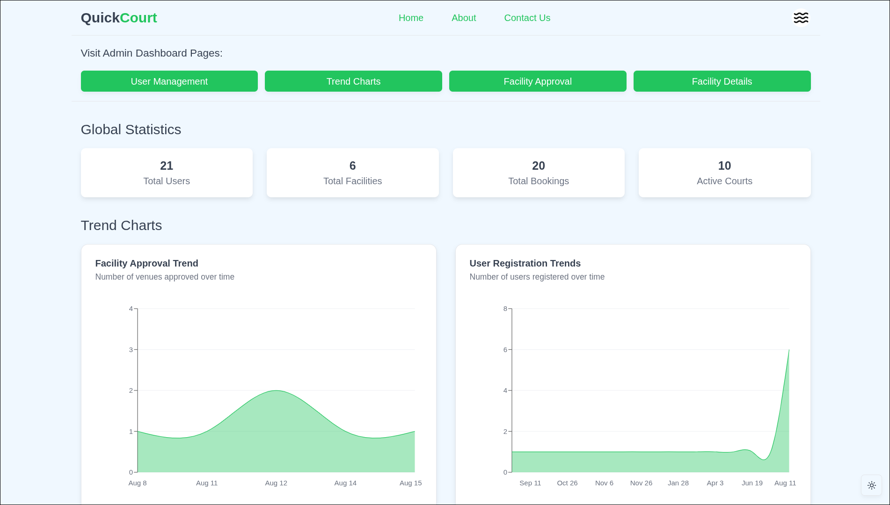

# QuickCourt – Sports Facility Booking Platform

**QuickCourt** is a full-stack web application that connects sports enthusiasts with local sports facilities.  
Whether you’re looking to book a badminton court, a turf ground, or a table tennis slot, QuickCourt enables you to discover venues, reserve time slots, and connect with others to play.

## YouTube Demo: https://youtu.be/4taAAvy53TE

## Problem Statement
Booking local sports facilities often involves manual processes, unclear availability, and lack of streamlined communication between players and venue owners.  
QuickCourt solves this by providing:
- A **centralized platform** for users to find and book sports venues.
- **Accurate real-time availability** of courts.
- **Community engagement** through matches and reviews.

---

### Performance, Accessibility, Best Bractices and SEO Test
Test with Lighthouse


---

## Roles Overview
QuickCourt supports three roles, each with tailored features:

### **1. User**
- Browse and filter venues.
- Book courts with preferred time slots.
- Manage bookings, cancel if needed.

### **2. Facility Owner**
- Register and manage sports facilities.
- Set pricing, amenities, and availability.
- View and manage court bookings.
- Track earnings and usage trends.

### **3. Admin**
- Approve/reject new facility registrations.
- Manage users and facility owners.
- Oversee platform-wide booking trends and statistics.
- Acts as a super-user with all the rights.

---

### Login page (ShadCN/UI)
Example image showing Dark and Light mode in one


---

## 🛠 Tech Stack
- **Framework:** [Next.js 15](https://nextjs.org/) – App Router, server-side rendering, and modern UI patterns.
- **Database:** [PostgreSQL 16](https://www.postgresql.org/) via **Docker** for local development.
- **ORM:** [Drizzle ORM](https://orm.drizzle.team/) – Type-safe migrations and schema-first approach.
- **Authentication:** [Better Auth](https://better-auth.com/) with **Google** and **GitHub OAuth**.
- **Email Verification:** [Resend](https://resend.com/) for sending verification links.
- **UI Components:** [shadcn/ui](https://ui.shadcn.com/) + [Tailwind CSS](https://tailwindcss.com/) for styling.
- **Charts:** [Recharts](https://recharts.org/) for bar charts, area charts, and booking analytics.
- **Validation:** [Zod](https://zod.dev/) for schema validation.
- **Package Manager:** [pnpm](https://pnpm.io/).

---

## Charts & Visuals
QuickCourt uses **Recharts** integrated with **shadcn/ui** components to provide:
- **Booking trends**
- **Earnings summary**.
- **Peak booking hours**.
- Facility performance metrics.

--- 



---


---

## Email Verification
- After sign-up, users receive a **verification link** via **Resend** to activate their account.
- This ensures only verified users can make bookings.

---

## 📦 Installation & Setup

### Clone the repository
```bash
git clone https://github.com/ayushsingh-ayushsingh/QuickCourt
cd QuickCourt
```

### Install pnpm if not installed already
```bash
npm install -g pnpm
```

### Run the postgres container with Docker
```bash
docker compose up -d
```

### Install dependencies and dev dependencies
```bash
pnpm install
```

### Start the dev server
```bash
pnpm dev
```
The app will be available at http://localhost:3000.

## Database & Migrations (Drizzle ORM)
- **Type-safe SQL** for queries and migrations.
- **Schema-first** approach ensures reliability.

**Run migrations:**
```bash
pnpm drizzle-kit generate
pnpm drizzle-kit push
```

**View Schema and Tables:**

Drizzle studio provides clean experience on the browser

```bash
pnpm drizzle-kit studio
```

## Authentication Notes
Authentication can be **non-trivial** to implement securely.  
Using a stable provider like **Better Auth** ensures:
- Secure OAuth flows.
- Token management.
- Session handling.

---

## Future Improvements
- **Accessibility:** WCAG-compliant UI for all users.
- **Hosted Database:** Move from local Docker to a managed provider for scalability.
- **Detailed RBAC:** Fine-grained permissions for different roles.
- **Rigorous Testing:** Detailed unit and integration tests.
- **Deployment:** Host on **Cloudflare Edge Network** for low-latency performance.

---

### A project for Odoo-2025 Hackathon

Crafted with ♥️ by Ayush Singh